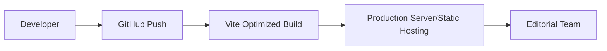
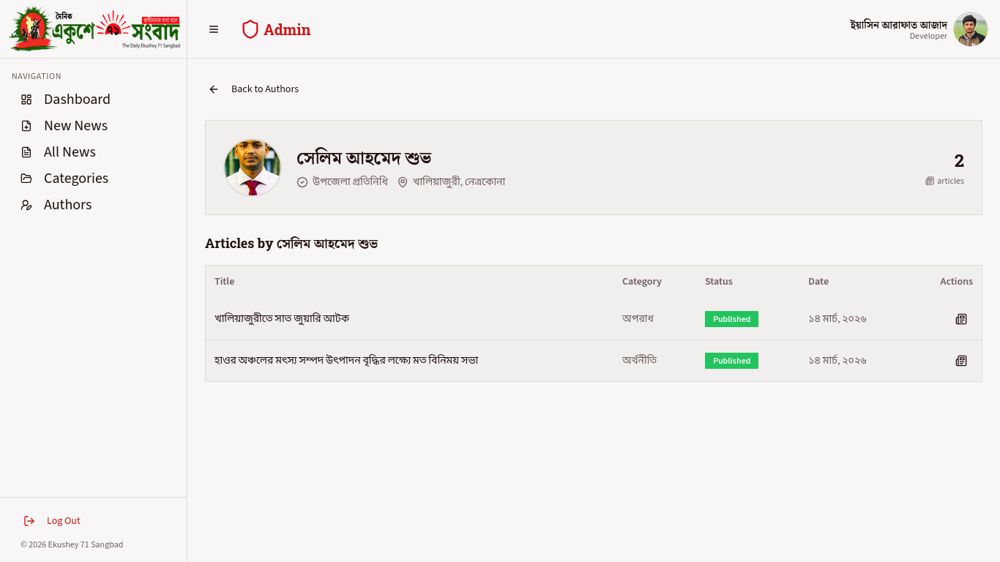
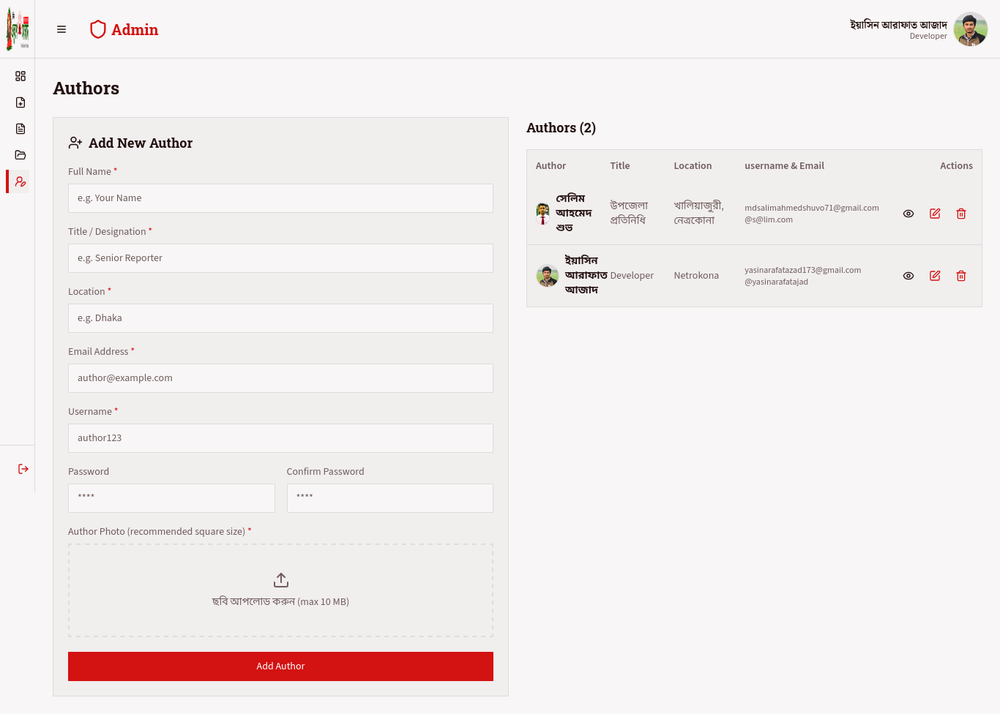

# Project Name : Ekushey 71 Sangbad | Admin Dashboard

---

## Project Overview

A robust, premium-grade administrative dashboard designed for the **Ekushey 71 Sangbad** editorial team. Built with **React 18** and **Vite**, this panel provides a high-performance workspace for managing news content, authors, and categories with precision and ease. It features a modern design system powered by **Shadcn UI** and **Tailwind CSS**.

---

## Time

- **Completed Duration**: 10 days
- **Dead Line**: 04 March 2026 - 03 April 2026
- **Status**: Production Ready
- **Last Updated**: 14 March 2026

---

## GitHub Badges


---

## Tech Stack

- **Framework**: [React 18](https://reactjs.org/) (Vite-based)
- **UI Architecture**: [Shadcn UI](https://ui.shadcn.com/)
- **Styling**: [Tailwind CSS](https://tailwindcss.com/)
- **State/Fetching**: [TanStack Query v5](https://tanstack.com/)
- **Routing**: [React Router v6](https://reactrouter.com/)
- **Media**: [Cloudinary](https://cloudinary.com/) (Image Uploads)
- **Package Manager**: pnpm

---

## Features [ADMIN]

**Content Management**:

- **Bilingual Editor**: Comprehensive post editor with support for Bangla (BN) and English (EN) titles and content.
- **Smart Image Handling**: Integrated Cloudinary upload with size validation (Max 10MB) and caption support.
- **Dynamic Tagging**: Flexible tag input system for SEO and categorization.
- **Slug Management**: Auto-generation of SEO-friendly slugs from English titles.

**Administrative Controls**:

- **Author Management**: Complete CRUD operations for journalist profiles and credentials.
- **Category Hierarchy**: Manage news sections and categories dynamically.
- **Authentication**: Secure admin login with persisted session management.

**Premium UI/UX**:

- **Overview Chart**: Shows latest news count with a 7, 30, 90 days toggle.
- **Responsive Sidebar**: Intelligent navigation with auto-collapse logic and enhanced iconography.
- **Stateful Feedback**: Real-time toast notifications for all system events and errors.
- **Accessibility**: Scaled typography and interactive elements for a better workspace experience.

---

## Project Structure

- `ADMIN/` - Main Administrative Application

```text
ADMIN/
├── src/
│   ├── components/      # UI components (shadcn/ui + custom)
│   ├── pages/           # Application views (Dashboard, Post Editor, etc.)
│   ├── hooks/           # Custom React hooks (toast, sidebar state)
│   ├── lib/             # API client, types, and utility functions
│   ├── assets/          # Static assets (logos, images)
│   └── App.tsx          # Main entry and route definitions
├── index.html           # HTML entry point
└── package.json         # Project manifests
```

---

## Deployed

The dashboard is built for high-availability environments and utilizes a modern build pipeline for fast production delivery.

**Deployment Flow:**



---

## Screenshots

| View        | Description                                    |
| ----------- | ---------------------------------------------- |
| Dashboard   |  |
| News |        |
| Author     |      |
| All Author     |      |

---

## Installation

### Prerequisites

- **Node.js** >= 18
- **pnpm** >= 8

---

## Setup Guide:

### [1]: Environment Configuration:

Create a `.env.local` file in the root:

```env
VITE_API_URL=https://api.ekushey71sangbad.com
VITE_CLOUDINARY_CLOUD_NAME=your_cloud_name
VITE_CLOUDINARY_UPLOAD_PRESET=your_preset
```

### [2]: Dependency Installation

```bash
pnpm install
```

### [3]: Development Mode

```bash
pnpm dev
```

### [4]: Production Build

```bash
pnpm build
pnpm preview
```

---

## Author

**Yasin Arafat Azad**  
_Mern-Stack Developer_

---

## License

This project is licensed under the **MIT License**.  
See the `LICENSE` file for details.
