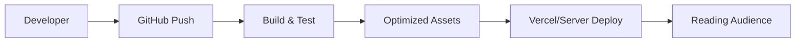
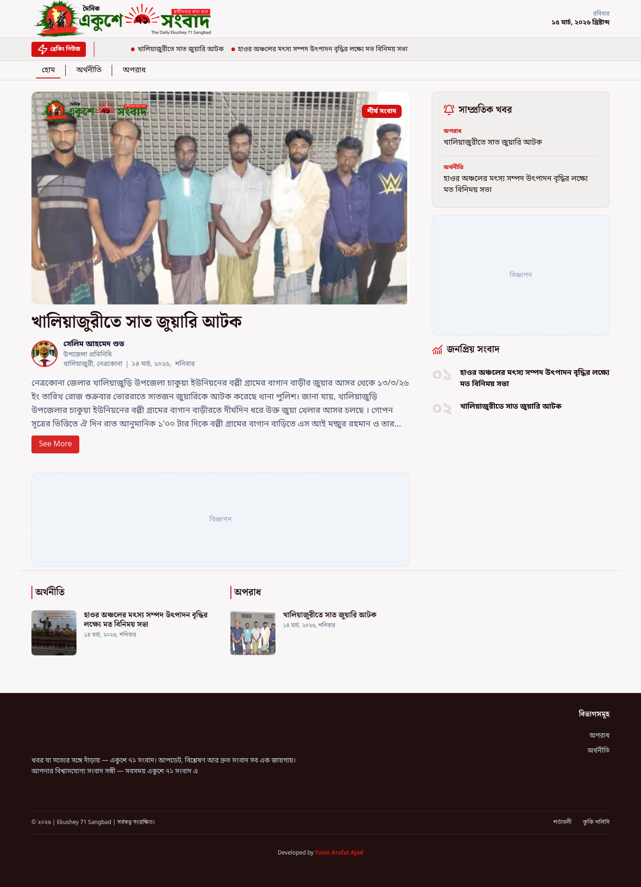
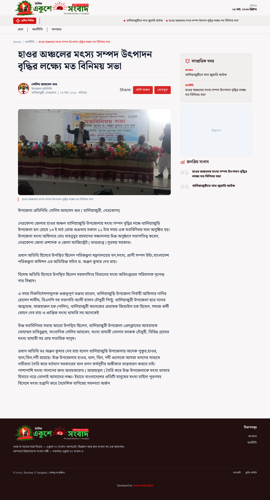

# Project Name : Ekushey 71 Sangbad | Client Portal

---

## Project Overview

This is the public-facing news portal for **Ekushey 71 Sangbad**. Built with **Next.js 16**, it provides a lightning-fast, SEO-optimized, and premium reading experience. The application features dynamic routing, server-side rendering, and modern UI components to ensure users receive the latest news with minimal latency.

---

## Time

- **Completed Duration**: 12 days
- **Dead Line**: 04 March 2026 - 03 April 2026
- **Status**: Production Ready
- **Last Updated**: 16 March 2026

---

## GitHub Badges


---

## Tech Stack

- **Framework**: [Next.js 16](https://nextjs.org/) (App Router)
- **Library**: [React 19](https://reactjs.org/)
- **Styling**: [Tailwind CSS v4](https://tailwindcss.com/)
- **Language**: TypeScript
- **State/Fetching**: Axios & Native Fetch
- **Package Manager**: pnpm

---

## Features [CLIENT]

**News Experience**:

- **Dynamic News Grid**: Curated home page with categorized news sections.
- **Article Details**: Immersive reading experience with dynamic slugs and social metadata.
- **Category Browsing**: Dedicated listing pages for all major news categories.
- **Bilingual Interface**: Seamless support for both Bangla and English content.

**Interface & UX**:

- **Responsive Design**: Fully fluid layouts optimized for mobile, tablet, and ultra-wide desktops.
- **Semantic HTML**: Accessibility-first structure for screen readers and SEO.
- **Optimized Media**: Next.js Image optimization for fast loading and low bandwidth usage.

---

## Project Structure

- `CLIENT/` - Main Frontend Application

```text
CLIENT/
├── src/
│   ├── app/             # Next.js App Router (pages & layouts)
│   ├── components/      # Modular UI components
│   │   ├── Layout/      # Header, Footer, Sidebar
│   │   ├── Sections/    # Page-specific content blocks
│   │   └── ui/          # Low-level primitives
│   ├── lib/             # API clients & utilities
│   └── assets/          # Static local assets
├── public/              # Global static assets
└── package.json         # Project manifests
```

---

## Deployed

The portal is optimized for production deployment on **Vercel** or **Node.js** compatible environments, utilizing CI/CD for seamless updates.

**Deployment Flow:**



---

## Screenshots

| View          | Description                                  |
| ------------- | -------------------------------------------- |
| Homepage      |          |
| News Details  |    |

---

## Installation

### Prerequisites

- **Node.js** >= 18.17.0
- **pnpm** >= 8

---

## Setup Guide:

### [1]: Environment Configuration:

Create a `.env.local` file in the root:

```env
NEXT_PUBLIC_API_URL=https://api.ekushey71sangbad.com
```

### [2]: Dependency Installation

```bash
pnpm install
```

### [3]: Development Server

```bash
pnpm dev
```

### [4]: Production Build

```bash
pnpm build
pnpm start
```

---

## Author

**Yasin Arafat Azad**  
_Mern-Stack Developer_

---

## License

This project is licensed under the **MIT License**.  
See the `LICENSE` file for details.
