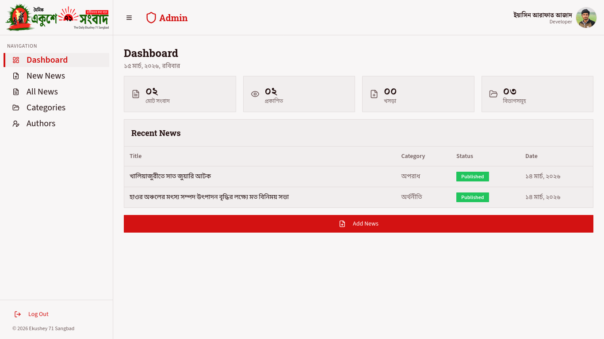
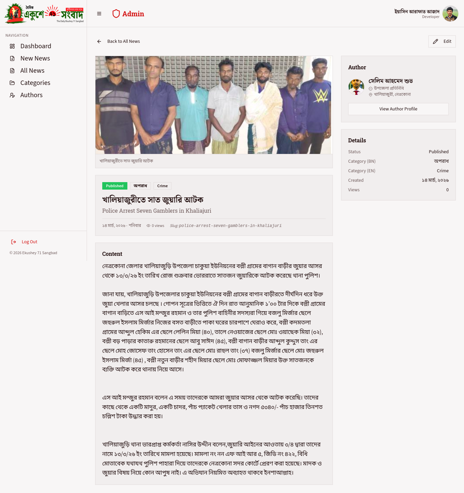

# Project Name : Ekushey 71 Sangbad | Multi-Tier News Platform

---

## Project Overview

**Ekushey 71 Sangbad** is a comprehensive, state-of-the-art news ecosystem designed for modern journalism. This repository contains a fully integrated multi-tier application consisting of a high-performance Public Portal, a robust Editorial Admin Dashboard, and a scalable Backend API.

---

## 🏗️ Project Architecture

The system is organized into three core specialized layers:

1. **[CLIENT](./CLIENT)**: Public-facing news portal built with **Next.js 16** and **Tailwind CSS v4**.
2. **[ADMIN](./ADMIN)**: Editorial dashboard for content management built with **React 18**, **Shadcn UI**, and **Vite**.
3. **[SERVER](./SERVER)**: Scalable RESTful API powering the entire ecosystem using **Node.js/Express v5** and **MongoDB**.

---

## 📊 Project Status

- **Completed Duration**: 10 days
- **Dead Line**: 04 March 2026 - 03 April 2026
- **Status**: Production Ready
- **Lead Developer**: Yasin Arafat Ajad
- **License**: [MIT](https://opensource.org/licenses/MIT)

---

## 🚀 GitHub Badges


---

## 🛠️ Technology Stack (Summary)

| Layer      | Framework/Stack         | Primary Tools                     |
| ---------- | ----------------------- | --------------------------------- |
| **CLIENT** | Next.js 16 (App Router) | React 19, Tailwind v4, Axios      |
| **ADMIN**  | React 18 (Vite)         | Shadcn UI, TanStack Query, Radix  |
| **SERVER** | Node.js (Express v5)    | TypeScript, Mongoose, JWT, Helmet |

---

## ✨ Core Features

### 📰 Public Experience (CLIENT)

- **High Performance**: Optimized Core Web Vitals with Next.js Server Components.
- **Bilingual Support**: Native integration for Bangla and English content.
- **SEO & Social**: Automated metadata API for search engines and social sharing.

### ✍️ Editorial Management (ADMIN)

- **Unified Editor**: Specialized editor for managing bilingual news stories.
- **Media Engine**: Integrated Cloudinary support for smart image uploads (Max 10MB).
- **Control Center**: Full CRUD for authors, categories, and system metadata.

### 🔐 Backend Infrastructure (SERVER)

- **Security-First**: Integrated JWT auth, XSS protection, and rate limiting.
- **Data Integrity**: Strict Mongoose schemas and centralized error handling.
- **Performance**: Optimized API endpoints with high-concurrency support.

---

## 📂 Repository Structure

```text
Newspaper/
├── CLIENT/          # Frontend Web Portal (Next.js)
├── ADMIN/           # Editorial Dashboard (React/Vite)
├── SERVER/          # Backend REST API (Node/Express)
├── LICENSE          # System-wide MIT License
└── README.md        # Consolidated project documentation
```

---

## 🛠️ Installation & Setup

### Prerequisites

- **Node.js** >= 18
- **pnpm** >= 8
- **MongoDB** instance (for SERVER)
- **Cloudinary Account** (for ADMIN media)

### Quick Start

1. **Clone the Repository**:
   ```bash
   git clone git@github.com:yasinarafatajad/newspaper-Ekushey-71-Sangbad.git
   cd newspaper-Ekushey-71-Sangbad
   ```
2. **Database & API (SERVER)**:
   ```bash
   cd SERVER && pnpm install
   # Configure .env (see SERVER/README.md)
   pnpm dev
   ```
3. **Editorial Panel (ADMIN)**:
   ```bash
   cd ../ADMIN && pnpm install
   # Configure .env.local (see ADMIN/README.md)
   pnpm dev
   ```
4. **Public Portal (CLIENT)**:
   ```bash
   cd ../CLIENT && pnpm install
   # Configure .env.local (see CLIENT/README.md)
   pnpm dev
   ```

---

## 🖼️ Screenshots

| Platform   | View        | Preview                                              |
| ---------- | ----------- | ---------------------------------------------------- |
| **CLIENT** | Portal Home |         |
| **ADMIN**  | Dashboard   |  |
| **ADMIN**  | News        |            |

---

## 👷 Author

**Yasin Arafat Azad**  
_Senior Full-Stack Developer_

---

## 📜 License

This project is licensed under the **MIT License**.  
See the [LICENSE](./LICENSE) file for details.
