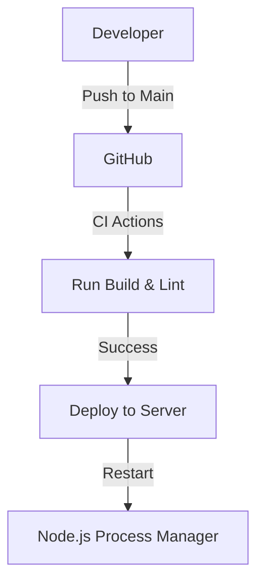

# Ekushey 71 Sangbad - Backend API

A high-performance, secure, and scalable RESTful API powering the Ekushey 71 Sangbad news platform. Built with a modern Node.js stack and industry-standard security practices.

---

## 🚀 Project Overview

This backend service manages the core business logic, data persistence, and administrative operations for the news portal. It provides a robust API for the ADMIN dashboard and CLIENT frontend, ensuring optimized content delivery and secure authenticated access.

---

## 📊 Project Status

- **Phase**: Production Ready 
- **Lead Developer**: Yasin Arafat Ajad
- **License**: [MIT](https://opensource.org/licenses/MIT)

---

## 🛠️ Tech Stack

- **Runtime**: [Node.js](https://nodejs.org/) (v18+)
- **Framework**: [Express.js v5](https://expressjs.com/) (Next-gen Express)
- **Language**: [TypeScript](https://www.typescriptlang.org/)
- **Database**: [MongoDB](https://www.mongodb.com/) with [Mongoose](https://mongoosejs.com/)
- **Security**:
  - [JWT](https://jwt.io/) (Authentication)
  - [BcryptJS](https://github.com/dcodeIO/bcrypt.js) (Password Hashing)
  - [Helmet](https://helmetjs.github.io/) (Security Headers)
  - [XSS-Clean](https://www.npmjs.com/package/xss-clean) (Sanitization)
  - [Express Rate Limit](https://www.npmjs.com/package/express-rate-limit) (DDoS Protection)
- **Logging**: [Morgan](https://github.com/expressjs/morgan) & Custom Middleware
- **Dev Tooling**: [tsx](https://tsx.is/) (Native TS execution)

---

## ✨ Features [BACKEND]

### 🔐 Authentication & Security

- **JWT-based Auth**: Secure session management for administrative users.
- **Middleware Security**: Integrated protection against XSS, NoSQL Injection, and common web vulnerabilities.
- **Password Policies**: Strong industrial-grade hashing using Bcrypt.

### 📰 Content & Entity Management

- **News Engine**: Full CRUD operations for news posts with bilingual field support.
- **Category Management**: Hierarchical category structuring.
- **Author Profiles**: Management of journalist and contributor metadata.
- **Media Uploads**: API-level support for managing media references (Cloudinary integration).

### ⚙️ System Features

- **Centralized Error Handling**: Uniform API response format for all error types.
- **Configuration Management**: Zero-config environment handling with `dotenv`.
- **Performance**: Optimized Mongoose queries and indexing.

---

## 📂 Project Structure

```bash
SERVER/
├── src/
│   ├── config/          # Database and environmental configurations
│   ├── controllers/     # Request/Response logic (Business layer)
│   ├── models/          # Mongoose Schemas & Data definitions
│   ├── routes/          # API Route definitions
│   ├── lib/             # Utility functions and core helpers
│   ├── index.ts         # Application entry point
│   └── .env             # Global environment variables
├── package.json         # Dependency and script management
└── tsconfig.json        # TypeScript compiler settings
```

---

## 🛠️ Installation & Setup

### Prerequisites

- [Node.js](https://nodejs.org/) >= 18
- [pnpm](https://pnpm.io/) (recommended)
- [MongoDB](https://www.mongodb.com/) instance (local or Atlas)

### Steps

1. **Navigate to Directory**:
   ```bash
   cd Newspaper/SERVER
   ```
2. **Install Dependencies**:
   ```bash
   pnpm install
   ```
3. **Environment Setup**:
   Create a `.env` file based on `.env.example`:
   ```env
   PORT=5000
   MONGO_URI=your_mongodb_connection_string
   JWT_SECRET=your_jwt_secret_key
   ```
4. **Development Mode**:
   ```bash
   pnpm dev
   ```
5. **Production Build**:
   ```bash
   pnpm build
   pnpm start
   ```

---

## 🛰️ API Deployment

The server is configured for automated deployment via CI/CD pipelines. It can be hosted on cloud providers (VPS, Heroku, Render) or integrated within cPanel Node.js environments.

**Deployment Flow:**



---

## 👷 Author

**Yasin Arafat Ajad**  
_Full-Stack Solutions Architect_

---

## 📜 License

Licensed under the **MIT License**. See [LICENSE](../LICENSE) for full details.
